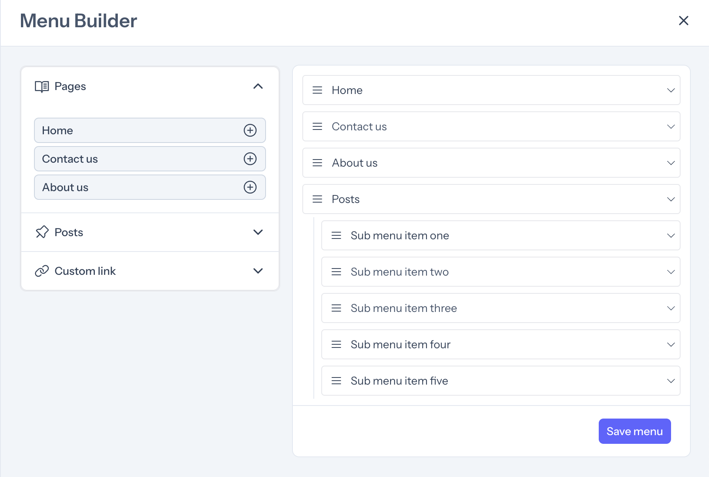
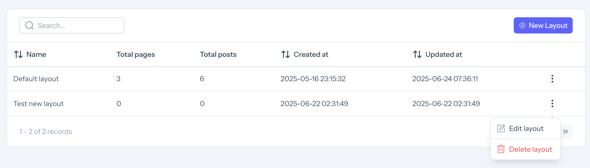
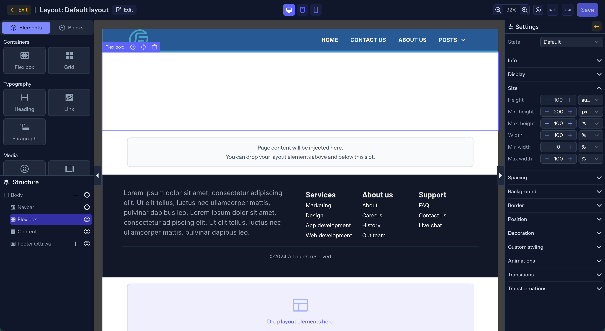
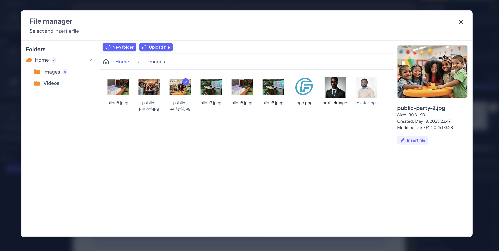
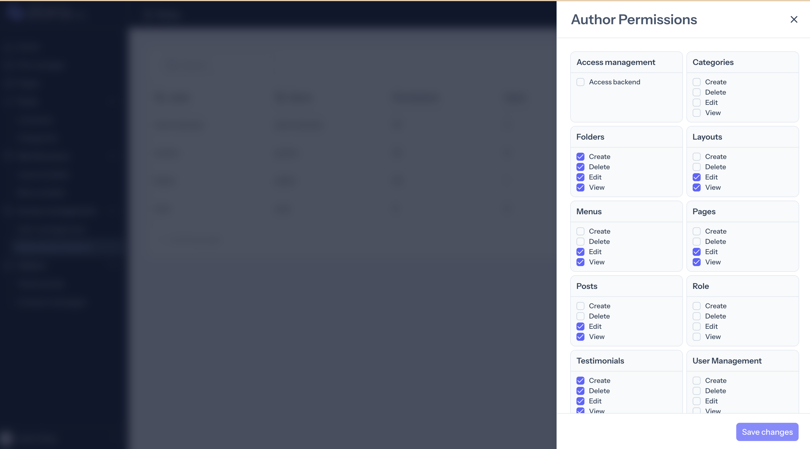

# Working with the site builder

[[toc]]

## Login and first steps

Once installed, you can login with the user created when the application was initialized. To access the admin panel, navigate to `/cp/login`. The `Admin` user has access to all parts of the application and can do pretty much any thing.

When logged in, the first thing is to create your layouts, pages, posts and menu before launching the drag-and-drop builder.

## Create a site structure

1. Once logged in, the first step is to create a layout. On the sidebar, click on `Layouts` and the `New Layout`. All you need to create a layout is the `name` of the layout. The name should be unique across the platform.
2. Next create your pages and posts. Each Page and Post must be linked to a Layout. This can be done via `pages > New page` or `posts > New Post` links.

3. Then create a menu. This will be useful when building navigations in the drag-and-drop builder. The menu also comes with a drag-and-drop menu builder that allows you to add pages, posts and custom links to the menu.
   

## The Site Builder

Layouts, Pages and Posts can be edited using the drag-and-drop site builder.
::: tip
Start by building your layouts before moving on to pages and posts.
:::

- Go to `Layout builder` on the sidebar menu in the Admin panel
- Click on `Edit layout` in the dropdown menu visible on each layout in the list table. This will launch the drag and drop builder.
  
- The builder interface is meant to be very intuitive as shown below.
  

- In the left sidebar, there is a section for `Elements` which contains UI elements that can be dragged and dropped to the canvas. Each element type has settings specific to it.

- The left sidebar also contains `Blocks`. These are pre-built components just to give you a head start, and they can be edited as you see fit, or not used at all.

- At the bottom of the left sidebar is the `Element tree`. This is very useful when you have many elements on the page and can easily lose track of what is what. You can rearrange elements on the tree by dragging and dropping as well.

- The center of the builder is the Canvas. This is where you drop page components.

- When an element is selected on the canvas, the settings for that element appear on the right sidebar, allowing you to customize styles and other unique properties of the component.

- On the top bar, you can switch between 3 device styles. The styles set for each component will apply to that component on the selected device size. The fallback is the `Desktop` styles.

- To the right of the top bar are action buttons to preview, save as draft or save and publish. You can also zoom and pan on the canvas from there.

## Versioning pages and posts

ZioraCMS allows you to edit versions of the page without publishing them to the front end. When a page or post is being edited, you can choose to `Save as draft`. If so, the current version will be saved but will not be published. You can also do `Save and publish` which will both save and publish the current changes.
Click on the `Preview` button to see how the current draft changes will look when published.

## File manager

ZioraCMS has a built-in file manager. For now, only images (jpeg, gif, png) are allowed but there are plans to expand to other file types in the future.

When editing pages in the builder, you can pick images (eg background images) simply by clicking on the button in the element settings. This will launch the file manager where you can pick an existing image or upload a new image and then pick it.

Files are uploaded using `chunk uploads` so, even though not quite advisable, large files can be uploaded faster as they are broken down into `1MB` chunks and sent to the server.

## User and Role management

Admin users can manage users and their roles. They can also control what each role can do using predefined permissions. New users can be created and assigned roles. Once users are created, they can go to the interface to reset their passwords or login using the password created by admin.

ZioraCMS uses [Spatie Permissions](https://spatie.be/docs/laravel-permission/v6/introduction) package to assign permissions to roles. Then it uses policies to authorize actions both in the backend and front end. As site admin, you can control the permissions for each role from then interface.

The application comes with some predefined roles, but you are allowed to create new roles as required.
